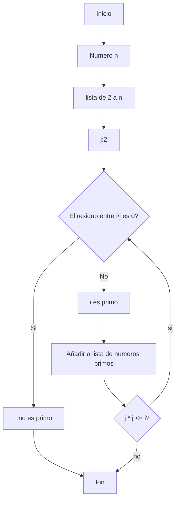

# RETO-03
Algoritmo para obtener los números primos hasta n
---
## Crear un algoritmo para obtener los números primos hasta n, usando pseudocódigo y diagramas de flujo.
### Usando pseudocódigos:
Inicié planteando el siguiente algoritmo 
```
Inicio 
* Paso 1. repetir para cada numero desde 2 hasta n
* Paso 1.1 Crear una lista de numeros naturales desde 2 hasta x elevado al cuadrado mas 1
* Paso 1.2 Repetir para casa numero i de la lista
* Paso 1.2.1 dividir x entre i
* Paso 1.2.2 si el residuo es 0 escribir x no es primo
* Paso 1.2.2.1 terminarl el ciclo
* Paso 1.2.3 si el residuo no es 0 escribir x es un numero primo
FIN
```
Sabiendo eso, añadi " crear una lista " y tome (i <= √x) como  (i * i <= x), así el pseudocodigó quedó de la siguiente manera:
```
[variables]
n : entero
i : entero
j : entero
primos : lista vacía

Inicio
  Para i desde 2 hasta n hacer
    Escribir "Verificar si i es primo, i´´
    Es primo := verdadero
    j := 2

    Mientras (j * j <= i) hacer
      Si modulo(i, j) == 0 entonces
        Escribir j, " es divisor de ", i
        Es primo := falso
        Salir del ciclo
      Sino
        Escribir j, " no es divisor de ", i
      j := j + 1
    Fin mientras
    
    Si Es primo entonces
      Escribir i, " es primo"
      Agregar i a Lista_primos
    Sino
      Escribir i, " no es primo"
  Fin para

  Escribir "Lista de números primos hasta ", n, ": ", Lista_primos
Fin
```
---
### Usando diagrama de flujo:
Según el pseudocódigo cree el siguiente diagrama de flujo:

#FINN !!
